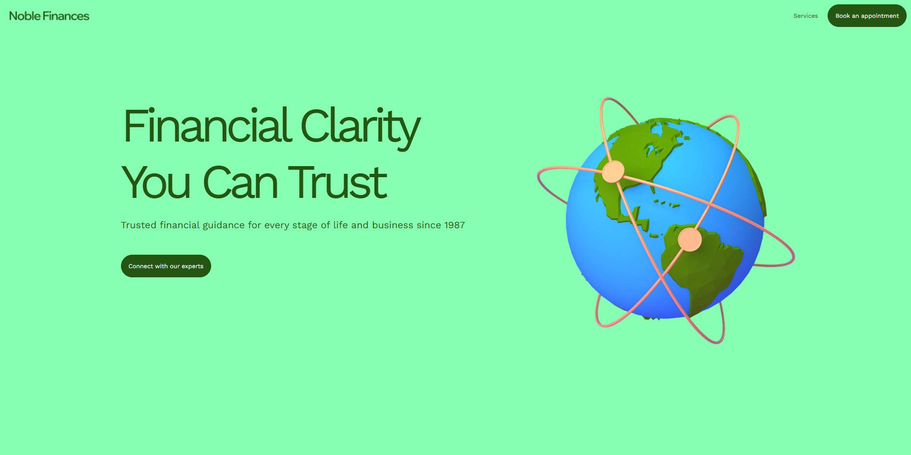
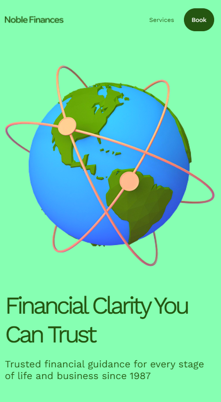

# 🌿 Portfolio Project – Front-End Website

---

## 📖 Overview

This project is a **modern, responsive website** built to demonstrate clean front-end architecture and adaptive design principles.  
It focuses on **clarity, accessibility, and scalability**, making it suitable for portfolios, landing pages, or product showcases.

The project was structured with modularity in mind, separating global, component, and layout styles for better maintainability.

---

## 🧩 Features

✅ Fully responsive design across all screen sizes  
✅ Semantic HTML structure  
✅ Organized and scalable CSS architecture  
✅ Modular file system with clear separation of styles  
✅ Lightweight and fast loading (no external frameworks)  
✅ Clean animations and transitions  
✅ Easy deployment on GitHub Pages

---

## 🏗️ Project Structure

📁 project-root
│
├── 📁 Global_Style/
│ ├── reset.css
│ ├── fonts.css
│ ├── ui_kit.css
│
├── 📁 Styles/
│ ├── style.css
│ ├── adaptive.css
│
├── 📁 Scripts/
│ └── main.js
│
├── index.html
└── README.md

Each folder serves a clear purpose:

- **Global_Style**: Universal resets, fonts, and UI elements
- **Styles**: Section-specific and adaptive layout rules
- **Scripts**: Minimal JavaScript for interactivity

**Warning**

The JavaScript was written using AI and is included in the project purely for the purpose of demonstrating the full functionality of the project, but in no way reflects the actual skills of the developer. Please be vigilant in this regard.

---

## 🎨 Design Notes

The project emphasizes:

- A **natural and modern color palette**
- Clear **visual hierarchy** for text and components
- **Consistent spacing and typography** for readability
- Mobile-first approach with adaptive adjustments

---

## 🚀 Deployment

This project is hosted on **GitHub Pages**.

🔗 **Live Demo:** [Add your GitHub Pages link here]

To deploy manually:

1. Push your project to a GitHub repository.
2. Go to **Settings → Pages**.
3. Select the branch (usually `main`) and `/ (root)` folder.
4. Save and wait a few minutes for the site to go live.

---

## 🧠 Technical Summary

| Aspect             | Evaluation                                  |
| :----------------- | :------------------------------------------ |
| **Design**         | ★★★★☆ — clean and modern, with good spacing |
| **Structure**      | ★★★★★ — semantic and organized              |
| **Responsiveness** | ★★★★☆ — consistent behavior across devices  |
| **Code Quality**   | ★★★★★ — modular and maintainable            |

---

## 📸 Screenshots

|                        Desktop                         |                        Mobile                        |
| :----------------------------------------------------: | :--------------------------------------------------: |
|  |  |

---

## 🧑‍💻 Author

**Dorbin.dev**  
💼 Front-End Developer  
📍 Based in Germany  
📫 [Email](dorbin.dev008@gmail.com)

---

## 📜 License

This project is licensed under the **MIT License** – feel free to use and modify it for your own projects.

---

⭐ **If you like this project, don’t forget to give it a star on GitHub!**
