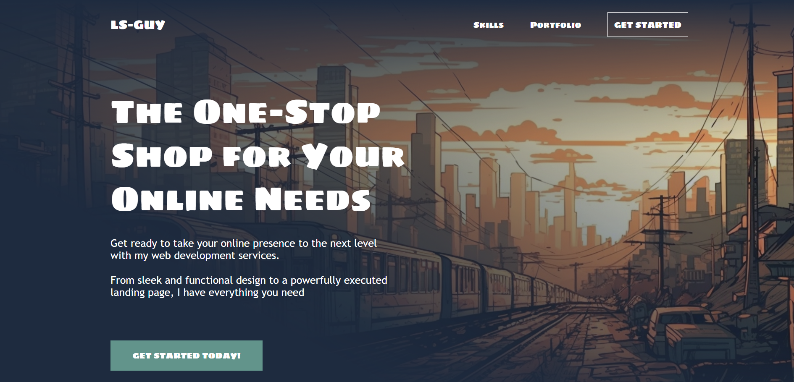
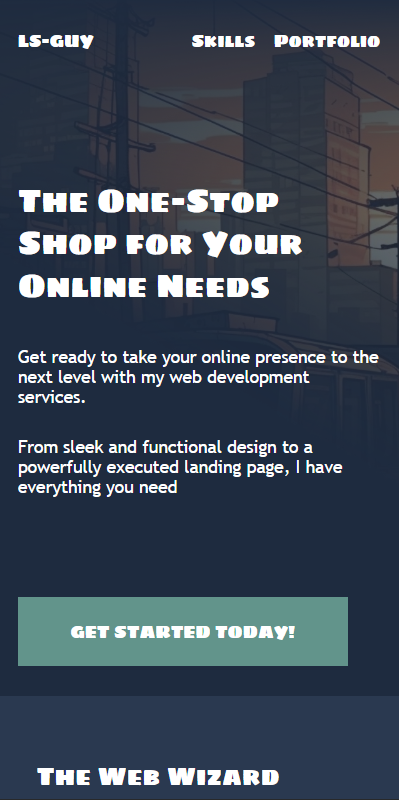

# 🧑‍💻 Frontend Developer Portfolio

A fully responsive **personal portfolio website** built with **HTML and CSS** to showcase my web development projects and skills.  
The website features clean, semantic code, smooth responsive design, and a focus on modern frontend practices.

---

## 🚀 Demo

🔗 **Live preview:** [View demo]()

---

## 🖼️ Screenshots

| Desktop Version                                         | Mobile Version                                        |
| ------------------------------------------------------- | ----------------------------------------------------- |
|  |  |

---

## 🧩 Features

- 🎨 **Modern, responsive design** — adapts perfectly to all screen sizes
- ⚡ **Optimized performance** — lightweight and fast-loading structure
- 🧱 **Semantic HTML** — accessible and SEO-friendly layout
- 📱 **Single breakpoint** — tablet & mobile adaptive design
- 🧠 **Reusable UI components** with consistent styling (UI Kit)
- 💾 **Clean, well-organized codebase** ready for extension

---

## 🛠️ Technologies Used

- **HTML5**
- **CSS3 (Flexbox, Responsive Design)**
- **Vanilla JavaScript**
- **GitHub Pages (for deployment)**

---

## 📂 Folder Structure

project-root/
│
├── Global_Style/
│ ├── reset.css
│ ├── fonts.css
│ ├── ui_kit.css
│
├── Styles/
│ ├── style.css
│ ├── adaptive.css
│
├── assets/
│ ├── images/
│ └── Icons/
│
├── index.html
└── README.md

---

## 💼 Projects Included

### 1️⃣ Sport Marathon Landing Page

- Built using **HTML and CSS**
- Fully responsive and pixel-perfect
- Clean and structured layout  
  🔗 [View Project](https://dorbindevfrlncr.github.io/dorbin-portfolio-projects/projects/sport-landing/home.html)

---

### 2️⃣ Financial Company Landing Page

- Implemented **JavaScript swipe bar**
- Smooth adaptive experience
- Modern typography and structure  
  🔗 [View Project](https://dorbindevfrlncr.github.io/dorbin-portfolio-projects/projects/finance-landing-page)

---

### 3️⃣ Law Firm Multi-page Landing

- Uses **Swiper JS** for interactive button
- Includes two additional CTA pages
- Responsive and user-friendly design  
  🔗 [View Project](https://dorbindevfrlncr.github.io/dorbin-portfolio-projects/projects/jones-brown-landing/home.html)

---

## 📬 Contact

Want to collaborate or hire me for a project?  
📧 **Email:** dorbin.dev008@gmail.com  
🌐 **Instagram:** [@dorbin.dev](https://www.instagram.com/dorbin.dev?igsh=aHFnMWNidHBzM280)  
💼 **LinkedIn:** 

---

## 📄 License

This project is licensed under the **MIT License** — feel free to use and modify it for your own purposes.

---

✨ _Created with passion by **LS-GUY (Dorbin.Dev)** — 2025_
