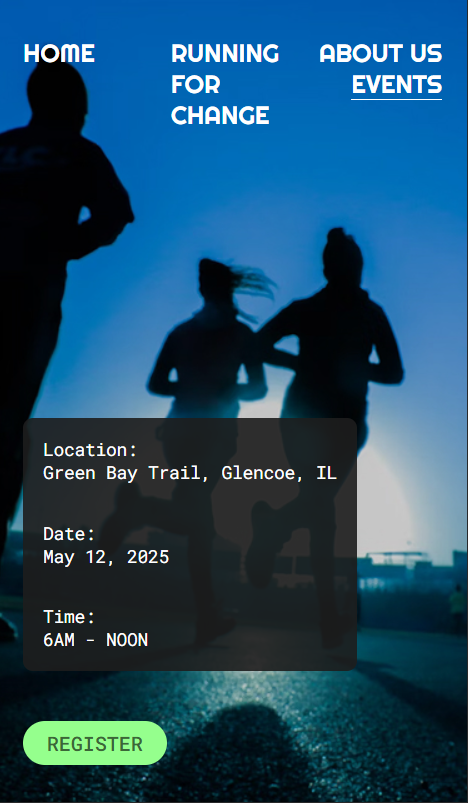
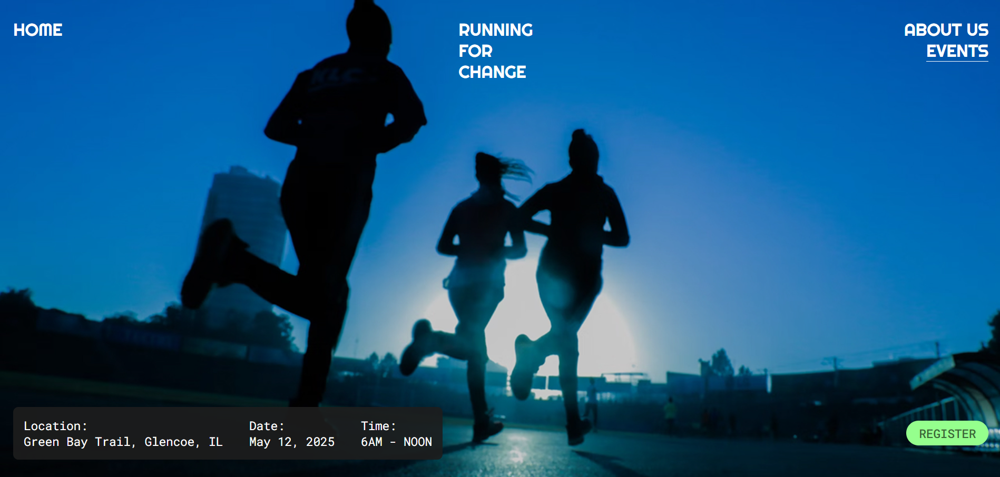

# 🏃‍♂️ Running For Change

A modern, fully responsive **landing page** built with pure **HTML and CSS** — no frameworks, no JavaScript.  
This project focuses on **clean structure, adaptive layout, and reusable UI components** while preserving strong design fidelity from the original Figma concept.

---

## 🌿 Overview

**Running For Change** is a minimal yet expressive one-page website promoting a charity running event.  
It demonstrates mastery in layout structuring, responsive scaling, and consistent visual language across mobile, tablet, and desktop breakpoints.

---

## 🚀 Live Demo

🔗 [View Live Project]()

---

### ✨ Key Features

- Fully responsive design (Mobile → Tablet → Desktop)
- Adaptive images per breakpoint for optimized loading
- Clean semantic HTML5 structure (`<main>`, `<section>`, `<footer>`, etc.)
- Modular CSS system with logical file division:
  - `reset.css` – baseline normalization
  - `fonts.css` – custom typefaces
  - `ui_kit.css` – reusable UI components and variables
  - `style.css` – core styling
  - `adaptive.css` – responsive rules
- Hover animations and interactive button states
- CSS variables for flexible color management and future scalability
- Lightweight, accessible, and SEO-friendly foundation

---

## 🖼️ Design Concept

The website blends **vibrant greens** with **dark contrast backgrounds** to evoke energy, motion, and a sense of renewal — reflecting the mission of _Running For Change_.  
Each section flows like a “stride”: from the motivational hero header to the mission-driven footer, maintaining thematic cohesion and readability.

---

## 🧩 File Structure

📦 project-root
├── 📁 Global_Style
│ ├── reset.css
│ ├── fonts.css
│ └── ui_kit.css
├── 📁 Styles
│ ├── style.css
│ └── adaptive.css
├── 📁 assets
│ ├── 📁 Icons
│ └── 📁 images
│ ├── mobile
│ ├── tablet
│ └── desktop
├── index.html

---

## 🧠 What This Project Demonstrates

This project showcases:

- Strong understanding of responsive web design principles
- Clean and maintainable code conventions
- Consistent visual rhythm and spacing
- Semantic and accessible markup
- Experience in translating Figma designs into pixel-perfect layouts

---

## 📸 Preview Gallery

|                     Mobile                      |                      Desktop                      |
| :---------------------------------------------: | :-----------------------------------------------: |
|  |  |

---

## 🧾 License

This project is licensed under the **MIT License** — see the [LICENSE]() file for details.

---

## 💬 Author

**dorbin.dev**  
Front-End Developer  
📍 Based in Germany  
🎨 Passionate about clean UI, modular CSS, and modern web layouts.
